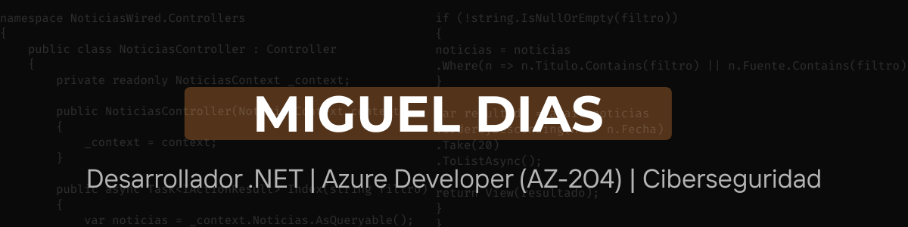

  

<h1 align="center" style="color:#F97316;"Miguel Dias</h1>
  

---

## 🧡 Sobre mí

Soy un desarrollador especializado en tecnologías Microsoft, con experiencia en:

💻 Desarrollador .NET enfocado en C#, ASP.NET Core y SQL Server  
☁️ Certificado AZ-204: Azure Developer Associate  
🔐 Máster en Ciberseguridad  
🌐 Estudiante de FP en Desarrollo de Aplicaciones Web  
🚀 Apasionado por la tecnología, la automatización y el desarrollo seguro

Me apasiona crear aplicaciones modernas, seguras y bien estructuradas, con un enfoque en buenas prácticas y arquitectura limpia.

---

## 🔥 Tecnologías y herramientas

  
  
  
  
  
  
  
  

---

## 🚀 Proyecto destacado

### 📰 Noticias WIRED  
Aplicación ASP.NET MVC + importador RSS en consola.  
CRUD completo, paginación, estilos personalizados y carga automática de noticias desde un feed RSS.

  

🔗 **Repositorio:** https://github.com/migueldegouveia/NoticiasWired

---

  

---

## 📊 Estadísticas de GitHub

  
  

---

## 📫 Contacto

📧 **Email:** migueldiasdg@gmail.com
🔗 **LinkedIn:** https://www.linkedin.com/in/migueldiasdg

  

<b style="color:#F97316;">¡Gracias por visitar mi perfil!</b>

